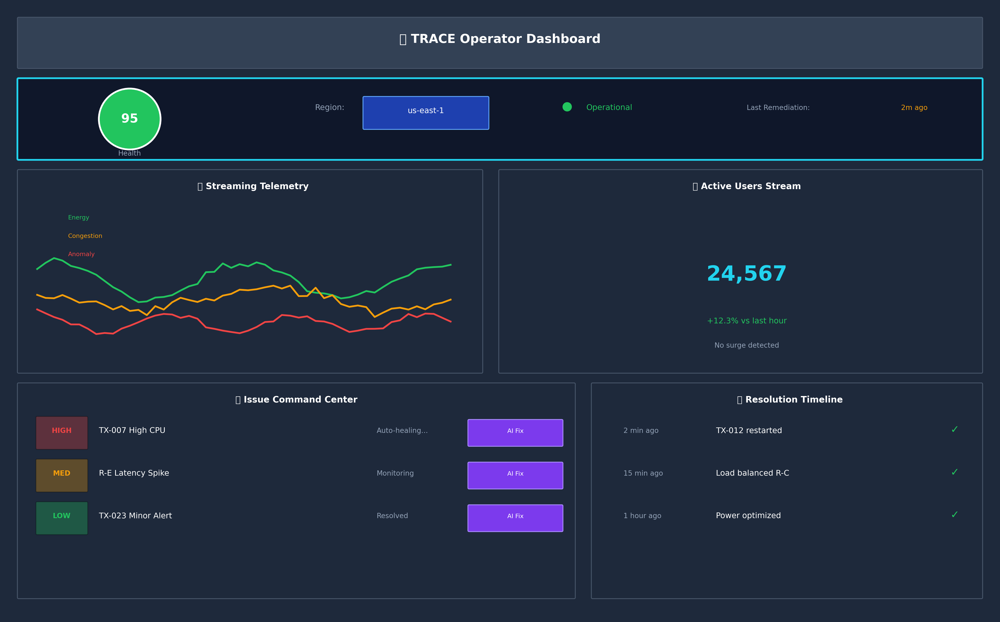
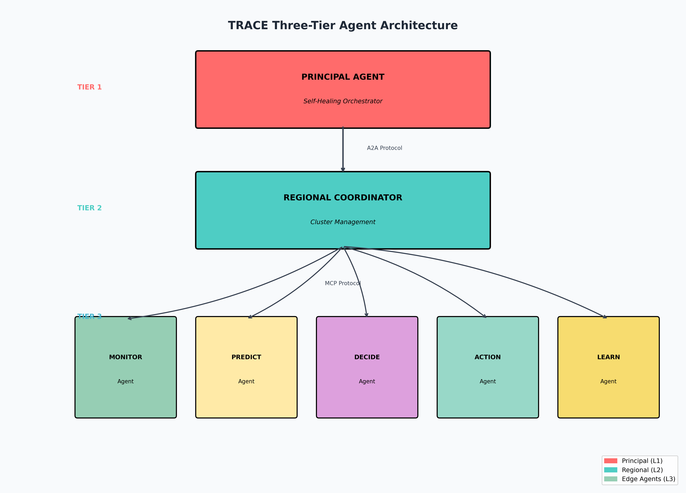

# TRACE - Telecom RAN AI-Powered Cognitive Engine<p align="center"># TRACE – Telecom RAN AI-Powered Cognitive Engine


An autonomous, self-healing telecom network management system powered by Amazon Bedrock Multi-Agent Architecture.  


**Live Demo:** https://d1cmtnu8ims6nq.cloudfront.net</p>[](https://aws.amazon.com/bedrock/)


---[](https://react.dev/)


## Overview<h1 align="center">TRACE</h1>[](https://python.org/)


TRACE transforms telecom network operations from reactive troubleshooting to proactive, autonomous management. Using 8 specialized AI agents powered by Amazon Bedrock, it monitors network health, predicts issues before they occur, and automatically remediates problems.<h3 align="center">Telecom RAN AI-Powered Cognitive Engine</h3>[](LICENSE)


### Key Features


- Autonomous detection and remediation of network issues<p align="center">> An autonomous, self-healing telecom network management system powered by Amazon Bedrock Multi-Agent Architecture

- 8 specialized AI agents working collaboratively

- Real-time telemetry streaming and visualization  <a href="https://aws.amazon.com/bedrock/"></a>

- Self-healing capabilities with minimal human intervention

- Energy optimization during low-demand periods  <a href="https://react.dev/"></a>**🔗 [Live Demo](https://d1cmtnu8ims6nq.cloudfront.net)**


---  <a href="https://python.org/"></a>


## Problem Statement  ---


Modern telecom operators face critical challenges:</p>


- 5G/O-RAN architectures have increased network elements by 10x## Table of Contents

- 73% of outages are detected by customers before NOC teams

- Average Mean Time to Repair (MTTR) is 4-6 hours<p align="center">

- 40% global shortage of trained network engineers

- $1-5M lost per hour of network downtime  An autonomous, self-healing telecom network management system<br/>- [Overview](#overview)


TRACE addresses these by deploying AI agents that continuously monitor, predict issues, and automatically remediate problems in minutes.  powered by Amazon Bedrock Multi-Agent Architecture- [Problem Statement](#problem-statement)


---</p>- [Architecture](#architecture)


## Architecture- [AWS Services](#aws-services)


The system uses a hierarchical multi-agent architecture:<p align="center">- [Quick Start](#quick-start)


**Principal Agent** - Global orchestrator handling cross-region coordination and escalation management  <a href="https://d1cmtnu8ims6nq.cloudfront.net"><strong>🔗 Live Demo</strong></a> ·- [Dashboard](#dashboard)


**Regional Coordinators (A & B)** - Manage regional clusters and resource allocation  <a href="#quick-start"><strong>Quick Start</strong></a> ·- [Project Structure](#project-structure)


**Edge Agents:**  <a href="#architecture"><strong>Architecture</strong></a>- [Technology Stack](#technology-stack)

- Monitoring Agent - Telemetry processing and anomaly detection

- Prediction Agent - ML-based forecasting and capacity planning</p>- [Business Outcomes](#business-outcomes)

- Decision xApp - Root cause analysis and action recommendations

- Action Agent - Remediation execution and configuration changes- [Team](#team)

- Learning Agent - Pattern recognition and playbook optimization

---

---

---

## AWS Services

## About

| Service | Purpose |

|---------|---------|## Overview

| Amazon Bedrock | Foundation models (Claude 3 Sonnet) for AI agents |

| AWS Lambda | Serverless functions for agent tools |TRACE transforms telecom network operations from reactive troubleshooting to **proactive, autonomous management**. Using 8 specialized AI agents powered by Amazon Bedrock, it monitors network health, predicts issues before they occur, and automatically remediates problems—reducing resolution time from hours to minutes.

| Amazon DynamoDB | Data storage for tower config, agent status, logs |

| Amazon API Gateway | REST API endpoints |TRACE is an AI-driven multi-agent system that transforms telecom network operations from reactive troubleshooting to proactive, autonomous management. Built entirely on AWS, it uses **Amazon Bedrock Agents** to monitor, predict, decide, and remediate network issues in real-time.

| Amazon S3 | Static website hosting |

| Amazon CloudFront | Global CDN for dashboard |### ✨ Key Features

| AWS IAM | Security roles and permissions |

### Key Capabilities

---

- **🤖 Autonomous Remediation** – AI agents automatically detect and fix network issues

## Deployed Agents

- **🔄 Multi-Agent Orchestration** – 8 specialized agents working collaboratively  - **Autonomous Remediation** – AI agents automatically detect and fix network issues

| Agent | Bedrock Agent ID |

|-------|------------------|- **📊 Real-time Monitoring** – Live telemetry streaming and visualization- **Multi-Agent Orchestration** – 8 specialized agents working collaboratively

| Principal Agent | N3LVTOXSFA |

| Regional Coordinator A | A1AK7SJQF6 |- **🔧 Self-Healing Network** – Automatic recovery with minimal human intervention- **Real-time Monitoring** – Live telemetry streaming and visualization

| Regional Coordinator B | JPA17IHQ0V |

| Decision xApp | N2EGAGVLEM |- **⚡ Energy Optimization** – Intelligent power management during low-demand periods- **Self-Healing Network** – Automatic recovery with minimal human intervention

| Monitoring Agent | ERZO1UFKHQ |

| Prediction Agent | LS0OWPC30J |- **Energy Optimization** – Intelligent power management during low-demand periods

| Action Agent | PNZVYMD3MH |

| Learning Agent | EHBDSQWYHB |---


------


## Quick Start## Problem


### Prerequisites## Problem Statement


- AWS Account with Bedrock access| Challenge | Impact |

- Python 3.12+

- Node.js 18+|-----------|--------|Modern telecom operators face critical challenges:

- AWS CLI configured

| Network Complexity | 5G/O-RAN increased network elements by **10x** |

### Deploy Infrastructure

| Reactive Operations | **73%** of outages detected by customers first || Challenge | Impact |

```bash

git clone https://github.com/ramyabarri1109-a11y/trace.git| Slow Resolution | Average MTTR is **4-6 hours** ||-----------|--------|

cd trace/aws-implementation

pip install -r requirements.txt| Skill Shortage | **40%** global shortage of network engineers || Network Complexity | 5G/O-RAN architectures increased network elements by 10x |


python 01-infrastructure/setup-infrastructure.py| Revenue Loss | **$1-5M** lost per hour of downtime || Reactive Operations | 73% of outages detected by customers before NOC teams |

python 04-agent-tools/deploy-tools.py

python 05-bedrock-agents/deploy-agents.py| Slow Resolution | Average Mean Time to Repair (MTTR) is 4-6 hours |

python 07-api-gateway/deploy-api.py

python 08-frontend/deploy-frontend.py---| Skill Shortage | 40% global shortage of trained network engineers |

```

| Revenue Loss | $1-5M lost per hour of network downtime |

### Run Dashboard Locally

## Architecture

```bash

cd client**TRACE solves this** by deploying AI agents that continuously monitor, predict issues before they occur, and automatically remediate problems in minutes instead of hours.

npm install

npm run dev<p align="center">

```

  ---

Open http://localhost:5173

</p>

---

## Architecture

## Dashboard Features

### Agent Hierarchy

- Real-time telemetry displaying CPU, Memory, and Latency metrics

- Issue Command Center with auto-detected issues and severity indicators```

- Agent pipeline visualization showing request flow through agents

- Chat interface for natural language interaction with AI agents```┌─────────────────────────────────────────────────────────────────┐

- One-click remediation execution

                    ┌─────────────────────┐│                   TRACE MULTI-AGENT SYSTEM                      │

---

                    │   PRINCIPAL AGENT   │├─────────────────────────────────────────────────────────────────┤

## Technology Stack

                    │   (Orchestrator)    ││                                                                 │

**Backend:** Python 3.12, Amazon Bedrock (Claude 3 Sonnet), AWS Lambda, DynamoDB

                    └──────────┬──────────┘│                    ┌─────────────────────┐                      │

**Frontend:** React 18, Vite, Material-UI, Recharts

                               ││                    │   PRINCIPAL AGENT   │                      │

**Infrastructure:** Amazon S3, CloudFront, API Gateway, IAM

          ┌────────────────────┼────────────────────┐│                    │   (Orchestrator)    │                      │

---

          ▼                    ▼                    ▼│                    └──────────┬──────────┘                      │

## Project Structure

  ┌───────────────┐   ┌───────────────┐   ┌───────────────┐│                               │                                 │

```

trace/  │   REGIONAL    │   │   REGIONAL    │   │   DECISION    ││          ┌────────────────────┼────────────────────┐            │

├── aws-implementation/     # AWS deployment scripts

│   ├── 01-infrastructure/  # DynamoDB, S3, IAM  │ COORDINATOR A │   │ COORDINATOR B │   │     xApp      ││          ▼                    ▼                    ▼            │

│   ├── 04-agent-tools/     # Lambda functions

│   ├── 05-bedrock-agents/  # Agent definitions  └───────────────┘   └───────────────┘   └───────────────┘│  ┌───────────────┐   ┌───────────────┐   ┌───────────────┐     │

│   ├── 07-api-gateway/     # API endpoints

│   └── 08-frontend/        # Frontend deployment          │                   ││  │   REGIONAL    │   │   REGIONAL    │   │   DECISION    │     │

├── client/                 # React dashboard

│   └── src/          └─────────┬─────────┘│  │ COORDINATOR A │   │ COORDINATOR B │   │     xApp      │     │

│       ├── components/     # UI components

│       └── services/       # API and WebSocket                    ▼│  └───────┬───────┘   └───────┬───────┘   └───────────────┘     │

├── data/                   # Sample telemetry

├── figures/                # Architecture diagrams  ┌──────────────────────────────────────────────────────┐│          │                   │                                  │

└── principal_agent/        # Reference implementation

```  │  MONITORING  │  PREDICTION  │  ACTION  │  LEARNING   ││  ┌───────┴───────────────────┴───────┐                         │


---  │    Agent     │    Agent     │  Agent   │   Agent     ││  │          EDGE AGENTS              │                         │


## Business Outcomes  └──────────────────────────────────────────────────────┘│  ├──────────┬──────────┬─────────────┤                         │


| Metric | Before | After | Improvement |```│  │MONITORING│PREDICTION│   ACTION    │                         │

|--------|--------|-------|-------------|

| Mean Time to Detect | 30-60 min | Under 30 sec | 99% faster |│  │  Agent   │  Agent   │   Agent     │                         │

| Mean Time to Repair | 4-6 hours | 5-15 min | 95% faster |

| Autonomous Resolution | 0% | 82% | New capability || Agent | Role |│  └──────────┴──────────┴─────────────┘                         │

| Network Availability | 99.5% | 99.99% | +0.49% |

|-------|------|│                    │                                            │

---

| **Principal** | Global orchestration, escalation management |│          ┌─────────┴─────────┐                                 │

## Team

| **Regional Coordinators** | Cluster management, resource allocation |│          │  LEARNING AGENT   │                                 │

- Vinay Dangeti

- Sudeep Aryan| **Monitoring** | Telemetry processing, anomaly detection |│          └───────────────────┘                                 │

- G S Neelam

- Ramya| **Prediction** | ML-based forecasting, capacity planning |│                                                                 │

- Aishwarya

| **Decision xApp** | Root cause analysis, action recommendations |└─────────────────────────────────────────────────────────────────┘

Contact: sudeeparyang@gmail.com

| **Action** | Remediation execution, configuration changes |```

---

| **Learning** | Pattern recognition, playbook optimization |

## License

### Agent Roles

MIT License

---

| Agent | Role | Responsibilities |

## Built With|-------|------|------------------|

| **Principal Agent** | Orchestrator | Cross-region coordination, escalation management |

| Category | Technologies || **Regional Coordinator** | Regional Manager | Cluster management, resource allocation |

|----------|--------------|| **Monitoring Agent** | Observability | Telemetry processing, anomaly detection |

| **AI/ML** | Amazon Bedrock, Claude 3 Sonnet || **Prediction Agent** | Forecasting | ML-based predictions, capacity planning |

| **Backend** | Python 3.12, AWS Lambda, DynamoDB || **Decision xApp** | Policy Engine | Root cause analysis, action recommendations |

| **Frontend** | React 18, Vite, Material-UI, Recharts || **Action Agent** | Executor | Remediation execution, configuration changes |

| **Infrastructure** | API Gateway, S3, CloudFront, IAM || **Learning Agent** | Intelligence | Pattern recognition, playbook optimization |


------


## Quick Start## AWS Services


### Prerequisites| Service | Purpose |

|---------|---------|

```| **Amazon Bedrock** | Foundation models (Claude 3 Sonnet) for AI agents |

✓ AWS Account with Bedrock access| **AWS Lambda** | Serverless functions for agent tools |

✓ Python 3.12+| **Amazon DynamoDB** | Data storage (tower config, agent status, logs) |

✓ Node.js 18+| **Amazon API Gateway** | REST API endpoints |

✓ AWS CLI configured| **Amazon S3** | Static website hosting |

```| **Amazon CloudFront** | Global CDN for dashboard |

| **AWS IAM** | Security roles and permissions |

### Installation

### Deployed Agents

```bash

# Clone the repository| Agent | Bedrock Agent ID | Status |

git clone https://github.com/ramyabarri1109-a11y/trace.git|-------|------------------|--------|

cd trace| Principal Agent | `N3LVTOXSFA` | ✅ Ready |

| Regional Coordinator A | `A1AK7SJQF6` | ✅ Ready |

# Deploy AWS infrastructure| Regional Coordinator B | `JPA17IHQ0V` | ✅ Ready |

cd aws-implementation| Decision xApp | `N2EGAGVLEM` | ✅ Ready |

pip install -r requirements.txt| Monitoring Agent | `ERZO1UFKHQ` | ✅ Ready |

python 01-infrastructure/setup-infrastructure.py| Prediction Agent | `LS0OWPC30J` | ✅ Ready |

python 04-agent-tools/deploy-tools.py| Action Agent | `PNZVYMD3MH` | ✅ Ready |

python 05-bedrock-agents/deploy-agents.py| Learning Agent | `EHBDSQWYHB` | ✅ Ready |

python 07-api-gateway/deploy-api.py

python 08-frontend/deploy-frontend.py---


# Run dashboard locally## Quick Start

cd ../client

npm install### Prerequisites

npm run dev

```- AWS Account with Bedrock access

- Python 3.12+

Open [http://localhost:5173](http://localhost:5173)- Node.js 18+

- AWS CLI configured

### Live Demo

### 1. Clone Repository

**Production Dashboard:** [https://d1cmtnu8ims6nq.cloudfront.net](https://d1cmtnu8ims6nq.cloudfront.net)

```bash

---git clone https://github.com/ramyabarri1109-a11y/trace.git

cd trace

## Dashboard```


<p align="center">### 2. Deploy AWS Infrastructure

  

</p>```bash

cd aws-implementation

| Feature | Description |pip install -r requirements.txt

|---------|-------------|

| **Real-time Telemetry** | Live CPU, Memory, Latency metrics |python 01-infrastructure/setup-infrastructure.py

| **Issue Command Center** | Auto-detected issues with severity indicators |python 04-agent-tools/deploy-tools.py

| **Agent Pipeline** | Visual flow: Monitoring → Prediction → Decision → Action |python 05-bedrock-agents/deploy-agents.py

| **Chat Interface** | Natural language interaction with AI agents |python 07-api-gateway/deploy-api.py

| **One-Click Remediation** | Execute AI-powered fixes instantly |python 08-frontend/deploy-frontend.py

```

---

### 3. Run Dashboard Locally

## Results

```bash

| Metric | Before | After | Improvement |cd client

|--------|--------|-------|:-----------:|npm install

| Mean Time to Detect | 30-60 min | < 30 sec | **99%** ⬇️ |npm run dev

| Mean Time to Repair | 4-6 hours | 5-15 min | **95%** ⬇️ |```

| Autonomous Resolution | 0% | 82% | **New** ✨ |

| Network Availability | 99.5% | 99.99% | **+0.49%** ⬆️ |Open http://localhost:5173


---### 4. Access Live Dashboard


## Project Structure**Production:** https://d1cmtnu8ims6nq.cloudfront.net


```---

trace/

├── aws-implementation/     # AWS deployment scripts## Dashboard

│   ├── 01-infrastructure/  # DynamoDB, S3, IAM

│   ├── 04-agent-tools/     # Lambda functionsThe TRACE dashboard provides real-time visibility into network operations:

│   ├── 05-bedrock-agents/  # Agent definitions

│   ├── 07-api-gateway/     # API endpoints- **Real-time Telemetry** – Live CPU, Memory, Latency metrics

│   └── 08-frontend/        # Frontend deployment- **Issue Command Center** – Auto-detected issues with AI remediation

│- **Agent Pipeline** – Visual flow: Monitoring → Prediction → Decision → Action → Learning

├── client/                 # React dashboard- **Chat Interface** – Natural language interaction with AI agents

│   └── src/

│       ├── components/     # UI components### Remediation Flow

│       └── services/       # API & WebSocket

│1. **Analyzing Issue** – AI examines root cause

├── data/                   # Sample telemetry2. **Agent Pipeline** – Request flows through specialized agents

├── figures/                # Architecture diagrams3. **Executing Remediation** – Action Agent applies fix

└── principal_agent/        # Reference implementation4. **Verification** – System confirms resolution

```

---

---

## Project Structure

## Deployed Agents

```

| Agent | Bedrock ID | Status |trace/

|-------|------------|:------:|├── aws-implementation/        # AWS deployment scripts

| Principal Agent | `N3LVTOXSFA` | ✅ |│   ├── 01-infrastructure/     # DynamoDB, S3, IAM

| Regional Coordinator A | `A1AK7SJQF6` | ✅ |│   ├── 04-agent-tools/        # Lambda functions

| Regional Coordinator B | `JPA17IHQ0V` | ✅ |│   ├── 05-bedrock-agents/     # Agent definitions

| Decision xApp | `N2EGAGVLEM` | ✅ |│   ├── 07-api-gateway/        # API endpoints

| Monitoring Agent | `ERZO1UFKHQ` | ✅ |│   └── 08-frontend/           # Frontend deployment

| Prediction Agent | `LS0OWPC30J` | ✅ |│

| Action Agent | `PNZVYMD3MH` | ✅ |├── client/                    # React dashboard

| Learning Agent | `EHBDSQWYHB` | ✅ |│   └── src/

│       ├── components/        # UI components

---│       └── services/          # API & WebSocket

│

## Team├── data/                      # Sample telemetry

├── figures/                   # Architecture diagrams

| Member | Contact |└── principal_agent/           # Reference implementation

|--------|---------|```

| Vinay Dangeti | |

| Sudeep Aryan | sudeeparyang@gmail.com |---

| G S Neelam | |

| Ramya | |## Technology Stack

| Aishwarya | |

### Backend

---

- Python 3.12

## License- Amazon Bedrock (Claude 3 Sonnet)

- AWS Lambda

Distributed under the MIT License. See `LICENSE` for more information.- DynamoDB


---### Frontend


<p align="center">- React 18

  <sub>Built with ❤️ using Amazon Bedrock</sub>- Vite

</p>- Material-UI

- Recharts

### Infrastructure

- Amazon S3 + CloudFront
- API Gateway
- IAM

---

## Business Outcomes

| Metric | Before | After | Improvement |
|--------|--------|-------|-------------|
| Mean Time to Detect | 30-60 min | < 30 sec | **99% faster** |
| Mean Time to Repair | 4-6 hours | 5-15 min | **95% faster** |
| Autonomous Resolution | 0% | 82% | **New capability** |
| Network Availability | 99.5% | 99.99% | **+0.49%** |

---

## Team

- Vinay Dangeti
- Sudeep Aryan
- G S Neelam
- Ramya
- Aishwarya

**Contact:** sudeeparyang@gmail.com

---

## License

MIT License – see [LICENSE](LICENSE) for details.

---

<p align="center">
  <strong>Built with ❤️ using Amazon Bedrock</strong>
</p>
